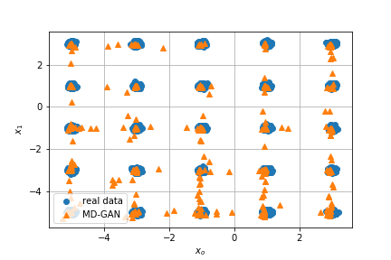
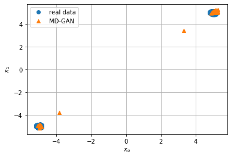

# MD-GAN

This repository contains PyTorch implementation of [MD-GAN](http://openaccess.thecvf.com/content_CVPR_2019/papers/Eghbal-zadeh_Mixture_Density_Generative_Adversarial_Networks_CVPR_2019_paper.pdf), along with training iPython notebook and trained models. Currently, this repository contains the training of data generated from a Gaussian mixture model (GMM). Two trained models included in this repository: the first one trained on data of a grid of 5 x 5 mixture of Gaussian and the second model trained on data of two mixture of Gaussian which are centered at -5 and 5.
  

The repository contains a [training notebook](examples/training_md_gan_25_gaussions.ipynb) for a Gaussian mixture model with 25 centers and a second notebook for Gaussian mixture model with [two centers](examples/training_md_gan_two_gaussions.ipynb).

The trained model are located in this repository at the models folder.

| Data    | Model Path            | Training Notebook                            |
|---------|-----------------------|----------------------------------------------|
| 25 GMM | models/generator_25.pt | examples/training_md_gan_25_gaussions.ipynb  |
| Two GMM  | models/generator_2.pt | examples/training_md_gan_two_gaussions.ipynb |

Note: this code is not well documented yet, this will be done in the near future.

Example figures: 

 

The left figure presents an example of real data and data generated using the MD-GAN D using the Gaussian mixture model with 25 and the right figure presents both the real data and generated data using MD-GAN while using the Gaussian mixture model with two centers.   
# Contributing
If you find a bug or have a question, please create a GitHub issue.
